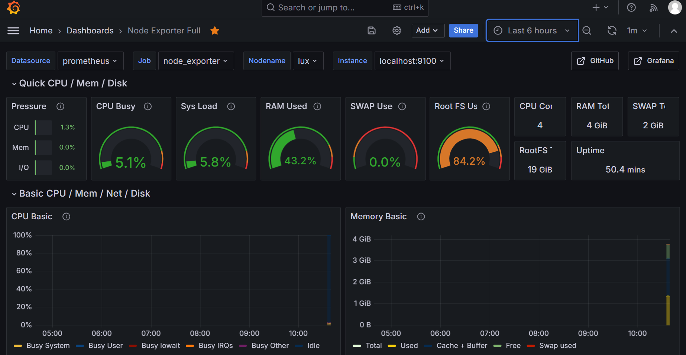

# 主机监控系统 (Node Exporter + Prometheus + Grafana)

[]()
[]()
[]()

本项目基于 Prometheus 开源监控栈，搭建了一套主机性能监控系统，实现了服务器 CPU、内存、磁盘、网络等核心指标的采集、存储与可视化展示。

---

## 技术栈

- **操作系统**：Ubuntu 22.04 LTS
- **指标采集**：Node Exporter 1.6.1
- **时序数据库**：Prometheus 3.10.0
- **可视化平台**：Grafana 10.4.1
- **工具链**：systemd、PromQL

---

## 快速开始

### 1. 克隆仓库
```bash
git clone https://github.com/你的用户名/server-monitor.git
cd server-monitor
```

### 2. 部署 Node Exporter
```bash
cd /opt
sudo wget https://github.com/prometheus/node_exporter/releases/download/v1.6.1/node_exporter-1.6.1.linux-amd64.tar.gz
sudo tar xvf node_exporter-1.6.1.linux-amd64.tar.gz
sudo mv node_exporter-1.6.1.linux-amd64 node_exporter
```
创建 systemd 服务并启动：
```bash
sudo tee /etc/systemd/system/node_exporter.service <<EOF
[Unit]
Description=Node Exporter
After=network.target

[Service]
Type=simple
User=root
ExecStart=/opt/node_exporter/node_exporter
Restart=always

[Install]
WantedBy=multi-user.target
EOF

sudo systemctl daemon-reload
sudo systemctl enable --now node_exporter
```

### 3. 部署 Prometheus
```bash
cd /opt
sudo wget https://mirrors.tuna.tsinghua.edu.cn/github-release/prometheus/prometheus/LatestRelease/prometheus-3.10.0.linux-amd64.tar.gz
sudo tar xvf prometheus-3.10.0.linux-amd64.tar.gz
sudo mv prometheus-3.10.0.linux-amd64 prometheus
```

编辑配置文件 `/opt/prometheus/prometheus.yml`，添加 Node Exporter 抓取任务：
```yaml
global:
  scrape_interval: 15s
  evaluation_interval: 15s

alerting:
  alertmanagers:
    - static_configs:
        - targets: []

rule_files:
  # - "first_rules.yml"

scrape_configs:
  - job_name: "prometheus"
    static_configs:
      - targets: ["localhost:9090"]
        labels:
          app: "prometheus"

  - job_name: "node_exporter"
    static_configs:
      - targets: ["localhost:9100"]
        labels:
          app: "node_exporter"
```

创建 systemd 服务并启动：
```bash
sudo tee /etc/systemd/system/prometheus.service <<EOF
[Unit]
Description=Prometheus
After=network.target

[Service]
Type=simple
User=root
ExecStart=/opt/prometheus/prometheus --config.file=/opt/prometheus/prometheus.yml --storage.tsdb.path=/opt/prometheus/data
Restart=always

[Install]
WantedBy=multi-user.target
EOF

sudo systemctl daemon-reload
sudo systemctl enable --now prometheus
```

### 4. 部署 Grafana
```bash
# 添加官方 APT 源（国内加速可选用清华源）
sudo apt install -y software-properties-common wget
wget -q -O - https://packages.grafana.com/gpg.key | sudo apt-key add -
sudo add-apt-repository "deb https://packages.grafana.com/oss/deb stable main"
sudo apt update
sudo apt install -y grafana

sudo systemctl enable --now grafana-server
```

### 5. 配置 Grafana
- 访问 `http://服务器IP:3000`，默认账号/密码 `admin`/`admin`。
- 添加 Prometheus 数据源：URL `http://localhost:9090`。
- 导入官方仪表盘：ID `1860`（Node Exporter Full）。

---

## 核心实现

### 1. 手动部署与排障
由于国内网络环境不稳定，在部署过程中多次遇到 GitHub 下载失败、镜像站访问限制等问题。通过以下方法逐一解决：
- 使用清华、华为云等国内镜像加速下载；
- 对于镜像站也出现 403 的情况，采用本地下载后通过 `scp` 上传的方式绕过限制；
- 配置 systemd 服务时使用 `tee` 命令避免权限和格式错误。

### 2. Prometheus 配置要点
- `scrape_interval` 与 `evaluation_interval` 均设为 15s，保证数据采集与告警评估的实时性。
- 通过 `static_configs` 定义抓取目标，并使用 `labels` 添加自定义标签，便于 Grafana 中筛选。
- 配置验证：使用 `promtool check config` 检查语法。

### 3. Grafana 可视化
- 数据源类型选择 Prometheus，URL 指向本地 9090 端口。
- 仪表盘导入后，调整时间范围为最近 15 分钟即可看到实时数据。
- 面板包含 CPU 使用率、内存占用、磁盘空间、网络流量等常见指标。

### 4. 防火墙与安全
- 仅开放必要端口：9100（Node Exporter）、9090（Prometheus）、3000（Grafana）、22（SSH）。
- 使用 `ufw` 管理防火墙，避免关闭防火墙带来的安全风险。

---

## 📸 部署效果

| 监控仪表盘展示 |
|----------------|
|  |


---

## 📁 项目结构

```
server-monitor/
├── README.md                    # 项目文档
├── screenshots/                 # 部署效果截图
│   └── dashboard.png
└── configs/                     # 参考配置文件
    ├── prometheus.yml           # Prometheus 配置示例
    ├── node_exporter.service    # Node Exporter systemd 服务文件
    └── prometheus.service       # Prometheus systemd 服务文件
```

---

## 🔧 常见问题处理

| 问题现象 | 根因分析 | 解决方案 |
|----------|----------|----------|
| `wget` 下载失败（403 / 连接超时） | 网络环境限制或镜像站临时故障 | 切换镜像源（清华、华为云）或使用本地下载后 `scp` 上传 |
| `sudo cat > file` 提示权限不足 | 重定向操作未使用 root 权限 | 改用 `sudo tee file > /dev/null` |
| Prometheus Targets 中 node_exporter 为 DOWN | 网络不通或服务未启动 | 检查 node_exporter 服务状态及防火墙 9100 端口是否开放 |
| Grafana 仪表盘无数据 | 数据源未正确连接或时间范围不当 | 确认 Prometheus 数据源 URL，并调整仪表盘右上角时间范围为最近 15 分钟 |
| 配置文件修改后 Prometheus 启动失败 | YAML 格式错误（缩进、拼写） | 使用 `promtool check config` 验证，参考 `configs/prometheus.yml` 示例 |

---

## 📬 说明

本项目为运维学习实践所用，适用于测试环境。生产环境部署建议：
- 启用 Grafana 用户认证与 HTTPS；
- 配置 Prometheus 数据持久化与备份；
- 监控多台服务器时，可将 Node Exporter 部署至各主机，并在 Prometheus 配置中批量添加 targets。

如需扩展告警功能，可基于 Grafana Alerting 或 Alertmanager 实现邮件/钉钉通知，进一步提升监控闭环完整性。

---

## 联系方式
- 邮箱：lux77769@gmail.com


